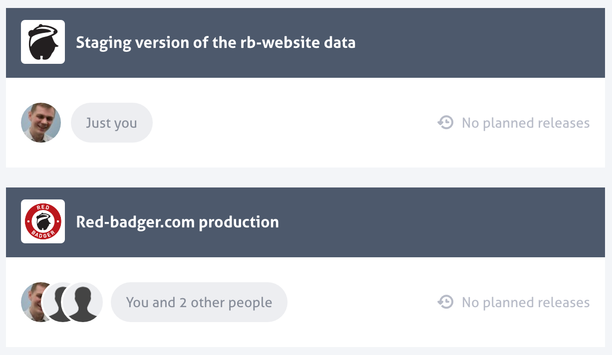
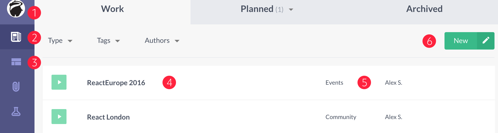

# Prismic Overview

###Access Prismic

To access Prismic, contact any of the #badgerlabs developers for the username and password then login [here](https://prismic.io/dashboard/).

###Choose an environment to work with

Once logged in, you will see the following screen:

We have two repositories on Prismic: Staging and Production. The data on Staging is displayed on the following websites:

[React London Staging](staging.react.london)
[Red Badger Staging](https://www-staging.red-badger.com/)

The data on Production is displayed on:

[React London Production](react.london)
[Red Badger Production](https://www-staging.red-badger.com/)

If you are a user that just adds events/speakers then use **production**, if you are a developer use **staging**.

###Navigating Prismic

1. Navigate back to select Prismic Environment
2. View all content in this Prismic Repository
3. View and edit our custom types Schema (Developers only)
4. Document Name
5. Document type
6. Add a new Document
