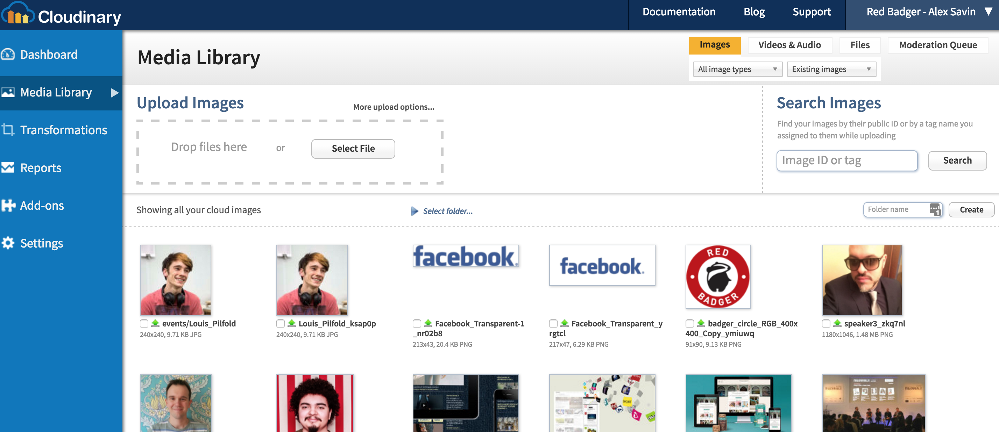
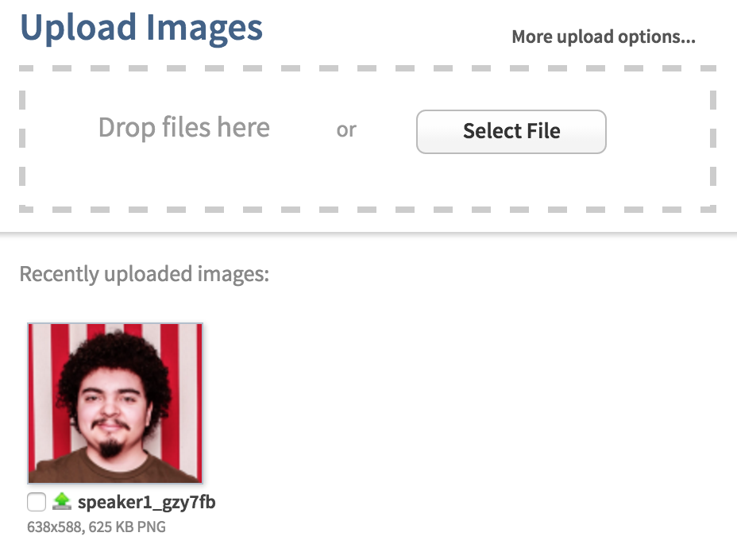
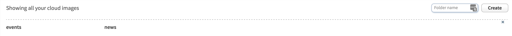
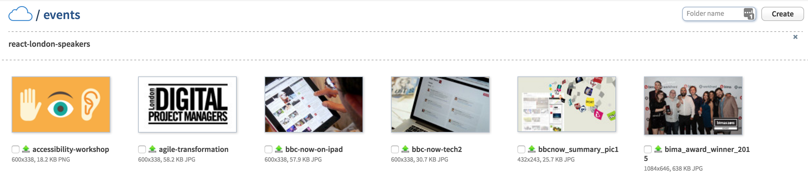
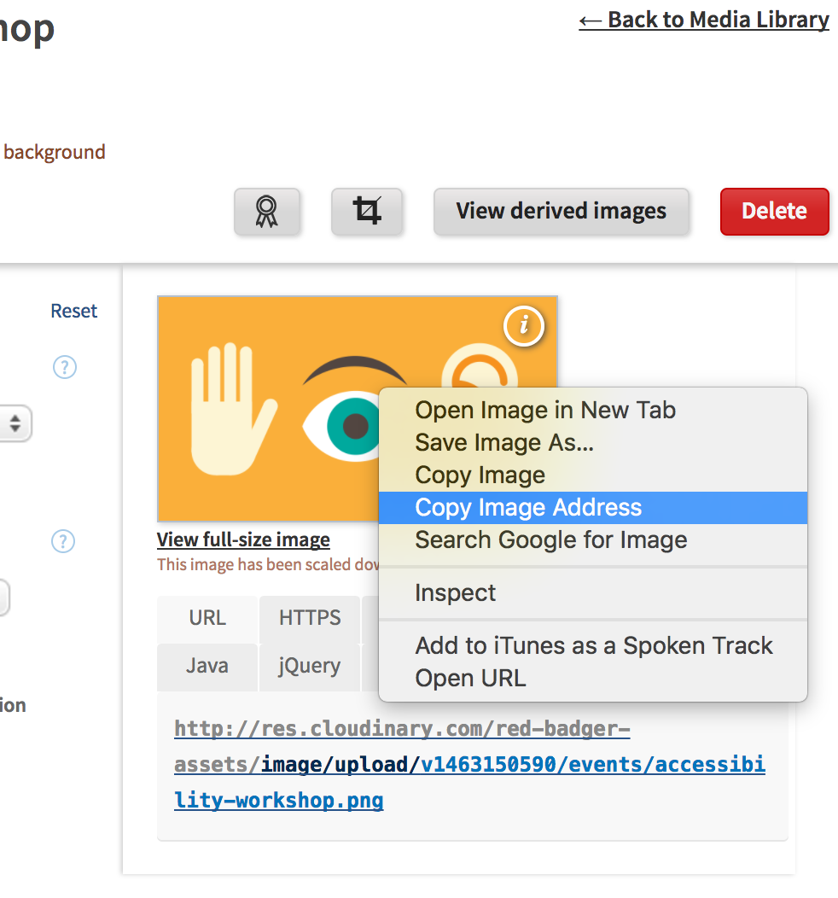

# Uploading images to Cloudinary

###Introduction

As you will see in later chapters, we will often need to display images on our website. To do so, we first need to upload these images to Cloudinary. We will then use the link provided by Cloudinary and store it on Prismic. This will make sense later on so don't stress!

####Step 1: Log into Cloudinary.

To upload an image to Cloudinary, you first need to gain access. Ask any of the #badgerlabs team on slack for the username and password. Then login [here](https://cloudinary.com/users/login).

####Step 2: Visit the Media Library.

When you first login, you are confronted with a really busy dashboard page. On the left hand side click Media Library and you should be shown all our current image uploads as follows:

####Uploading an Image

In the screenshot above there is a widget which allows you to 'Drop files here'. Drag the image you wish to upload into this box and you should see the following:

This will upload your image into the general folder. This is not however what we always want to do as we have organised our images on Cloudinary into 'speakers' and 'events'. It is easier to manage these images if they are sorted correctly, so we need to upload our images into the correct place.

To do so, click 'Select Folder' on the Media Library page:

and then select the image type:

You will then be shown all the images of that particular type. In this screenshot, I am showing the event images:

Now simply drag your image into the 'Drop files here' box and they will automatically be sorted into the events folder. The process is the same for the speaker images.

####Getting image links for Prismic:

The final step in this process is to get the image links for Prismic. To do so, go back to the Media Library and locate the image you wish to get the link for. Then simply right click it, and select 'Copy Image Address' as follows:

