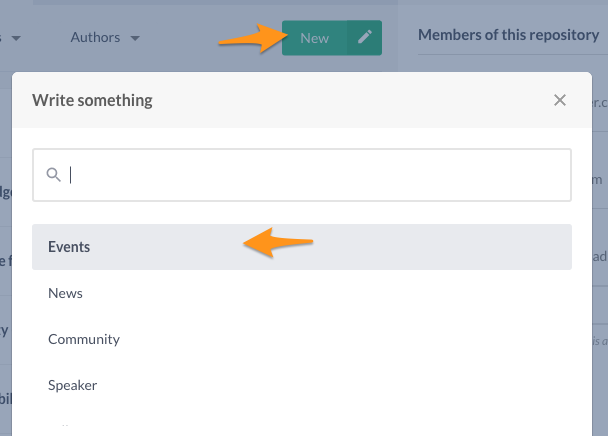
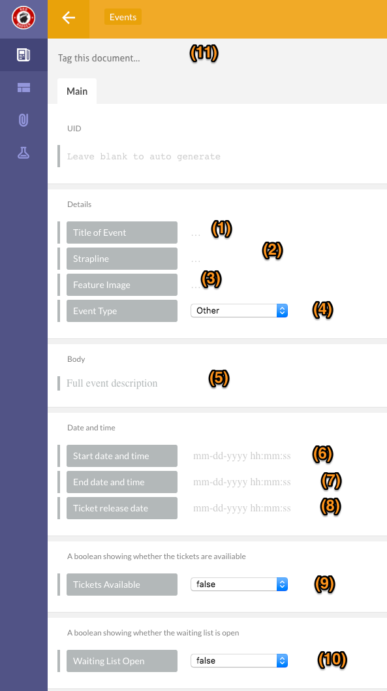
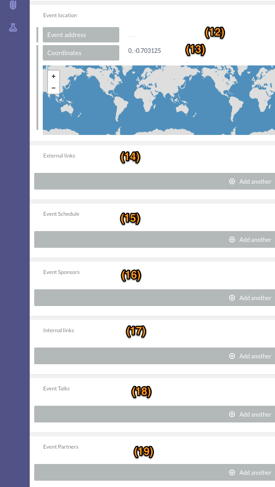
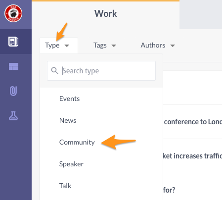
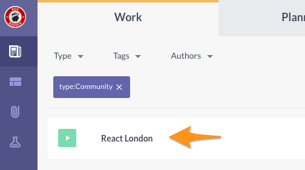
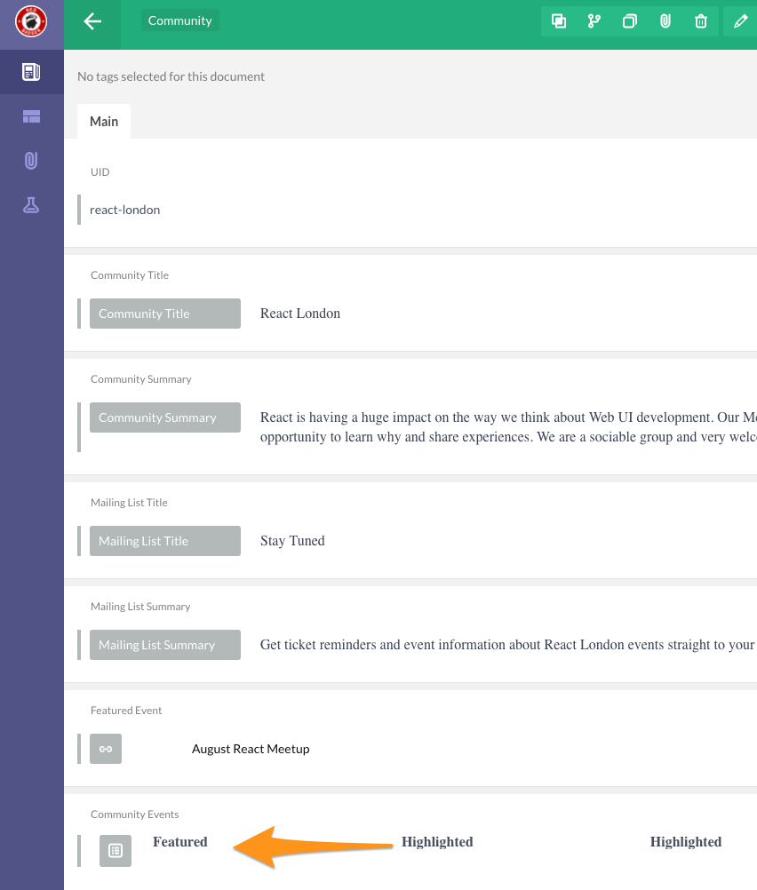
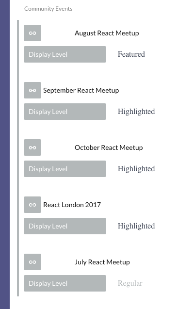

# Posting events

New events are created on Prismic. Navigate to [Red Badger production repository](https://rb-website.prismic.io/).

Event becomes visible on live site as soon as it is published on Prismic. You can see all events live at [https://red-badger.com/about-us/events/](https://red-badger.com/about-us/events/).

Select **New -> Events**

1. Title of Event - main title
2. Strapline - one liner of the event description
3. Feature Image - a filename of an image which is already uploaded on Cloudinary. Please refer to [Uploading images to Cloudinary guide](/chapter1.html).
4. Event Type - optional values are Other, Meetup or Conference. *Other* events will only be visible on the Website. If the event is a Meetup or a Conference, it will also be picked up by a relevant meetup or conference site - extra conditions apply.
5. Body - markdown body with the full event description
6. Start date and time - please specify both date and time
7. End date and time - full date and time of the event end. Useful for multiday events, but should also be specified for the single day events as it contains end time.
8. Ticket release date - full date and time of the ticket release moment. Used by React.London meetup site to display appropriate messages to the public about tickets availability.
9. Tickets Available - true or false - used by React.London meetup site to display appropriate messages to the public about tickets availability.
10. Waiting List Open - true or false - used by React.London meetup site to display appropriate messages to the public about waiting list availability.
11. Tags - event can be tagged and will become searchable by tag on the Website.
12. Event Address - full address of the event location
13. Coordinates - copy and paste Google Maps URL here with the location of the event
14. External links - event related links that are not on red-badger.com domain
15. Event Schedule - array of event schedule items, each consisting of timestamp and schedule item description. Used by [https://meetup.react.london/](https://meetup.react.london/) site for the  most upcoming event.
16. Event Sponsors - expands into a multiple fields where you can add sponsor website URL, image URL and name of the sponsor. This data is used by [https://meetup.react.london/](https://meetup.react.london/) site for the upcoming event - sponsor data will be displayed next to the Schedule section. *This will be eventually deprecated in favour of Partners on Prismic*
17. Internal links - event related links that are on red-badger.com domain.
18. Event Talks - you can specify list of talks related to this events. Talks are created as separate documents on Prismic. You have to create talks first before you can associate them with the given event.
19. Event Partners - you can associate existing partner documents on Prismic with this event. At the moment only used by React.London conference page. Partners must be created first as separate entries on Prismic before you can add them to the current event. *Note: meetup.react.london site will eventually use this field to list event partners*

### How to get meetup event to be displayed on react.london site?

React.london site will only display meetup events that are added to the list of the community events on the relevant Community document. Here’s how to update it.

Display only community documents on Prismic by selecting **Type -> Community**

Pick React.London community.

Click on Community Events

Once you click, all community events will reveal additional details.

Each item contains link to the event document (also created on Prismic), and Display Level option. Display Level can be set to Featured, Highlighted or Regular.

In order to set event as the main upcoming event, its Display Level must be set to Featured. Note that only 1 event at a time can be featured.

In order for event to be listed as one of the 3 upcoming events on React.London site, set its Display Level to Highlighted. Only 3 first events with Display Level set to Highlighted will be displayed on the site.
