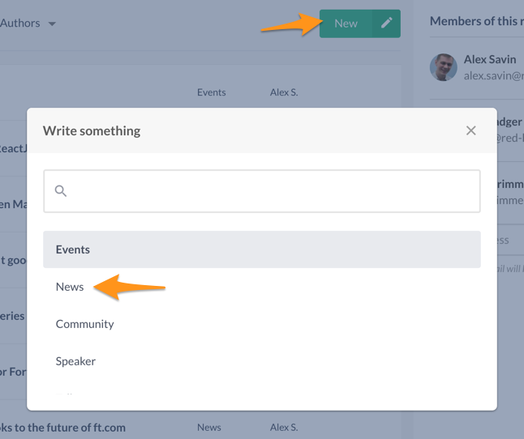
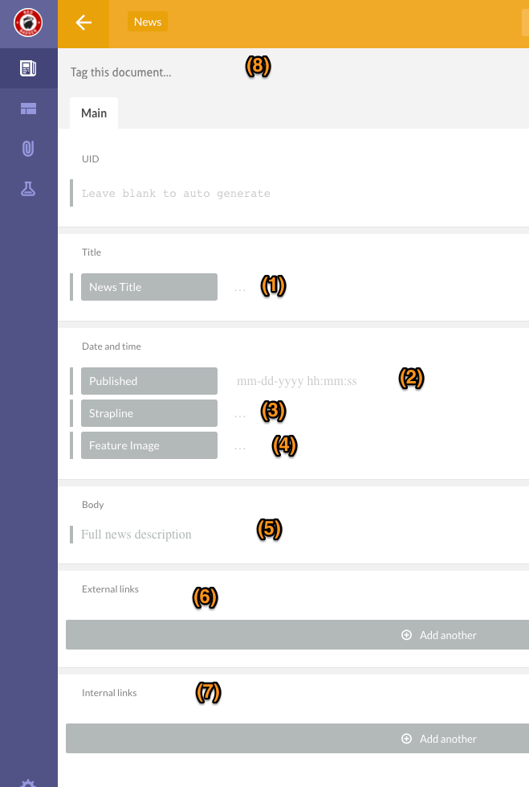

# Posting news items

In few easy steps you will learn how to post a news item on Website. All news items are visible at [https://red-badger.com/about-us/news/](https://red-badger.com/about-us/news/).

Your new item will become available on the live site as soon as you publish it on Prismic.

### Publishing

Please use **Red-badger.com production** repository

Press **New -> News**

This will present you with a News form.

1. Title of the news
2. Date and time of publishing - please note that you must specify correct time in order to prevent unpredictable behaviour of timezones.
3. Strapline - short one-liner describing the news
4. Featured image - a filename of an image which is already uploaded on Cloudinary. Please refer to [Uploading images to Cloudinary guide](/chapter1.html).
5. Body - markdown body of the news item. You can use markdown syntax, as well as multi paragraphs editing capabilities of the Prismic.
6. External links - related to the news links that are not on red-badger.com domain
7. Internal links - related to the news links that are on red-badger.com domain
8. Tags - optional list of tags related to the news

Once the news is saved and published on Prismic, it will immediately become visible on the live site. There is no staging capabilities at the moment.
