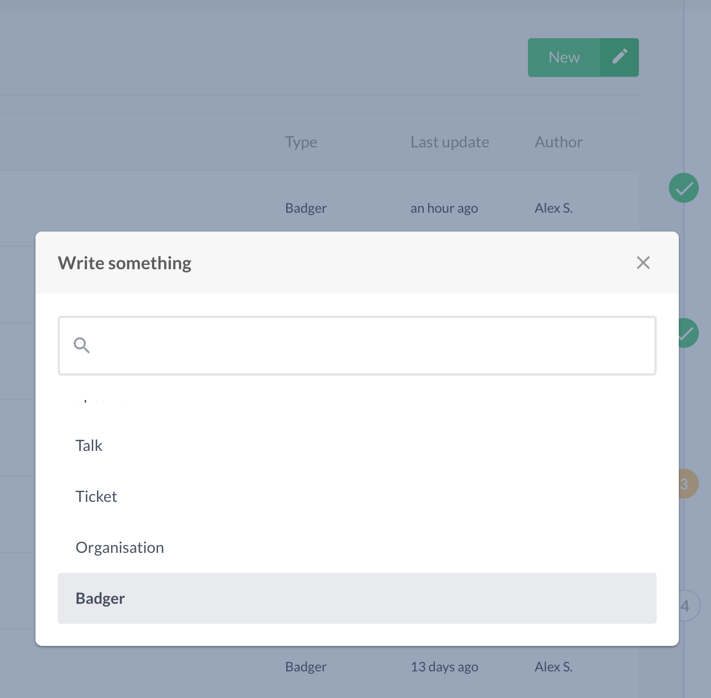
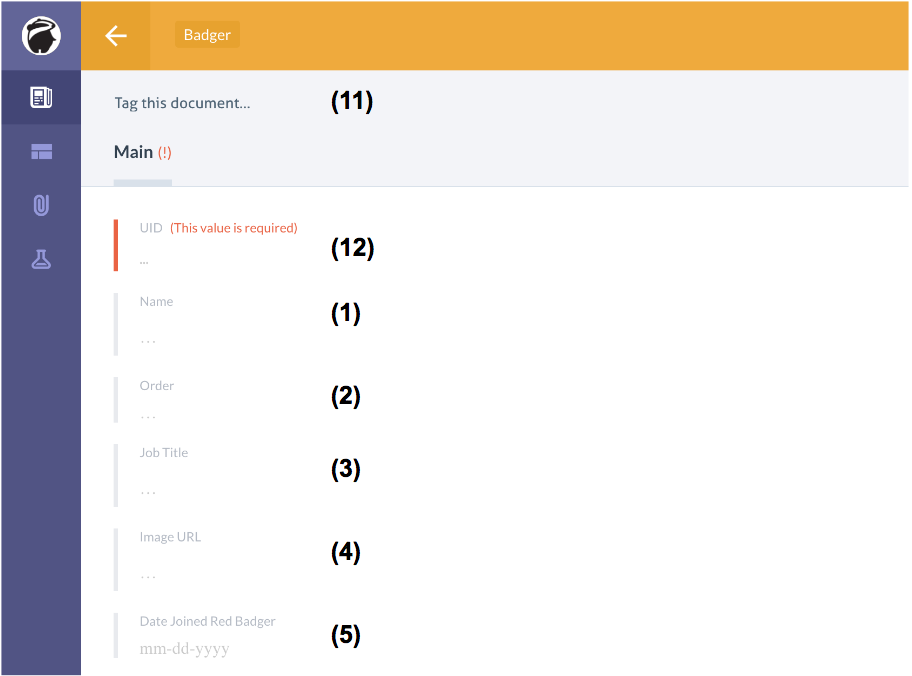
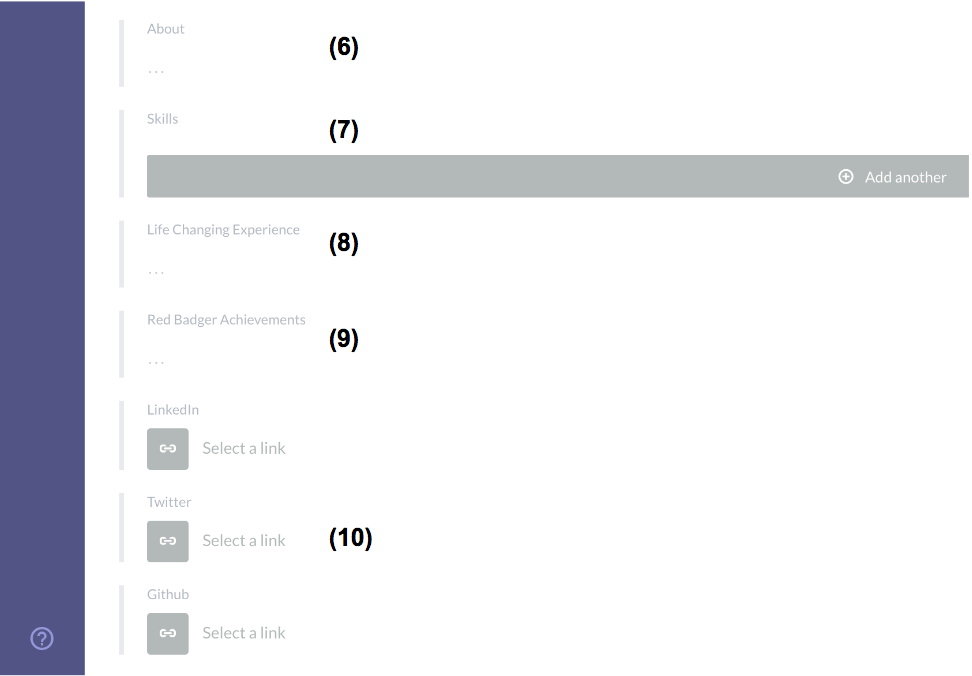
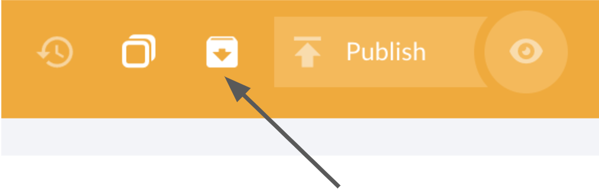

# Updating Badger list

This guide will help you updating the badgers information listed on our website's team page visible at [https://red-badger.com/about-us/people/](https://red-badger.com/about-us/people/)

Your new item will become available on the live site as soon as you publish it on Prismic.

### Creating

Please use **Red-badger.com production** repository

Press **New -> Badger**

This will present you with a new Badger form.

1. Name of the Badger.
2. The order of the Badger on the `Meet our team` page. Order numbers 1 - 4 should be given to David Wynne, Cain Ullah, Stuart Harris and Milo Castro respectively. The order number can be left blank for the other badgers.
3. The job title of the Badger.
4. The url of the picture to be displayed on the page. The url must be the full url and start with https://. Please refer to [Uploading images to Cloudinary guide](/chapter1.html).
5. The date the Badger started at Red Badger.
6. A summary of the Badger.
7. The signature skills of the Badger. Click the 'Add another' button to add a skill (only the top 3 will appear on the `Meet our team` page).
8. Life changing books/films/experiences of the badger.
9. Achievements at Red Badger.
10. The urls to the Badger's profile on LinkedIn, Twitter and Github.
11. Add tags to the Badger to make them belong to one or more of the following categories:
    - Leadership
    - Strategy
    - PM
    - UX & Design
    - Engineering
    - QA
    - Operations
    - Adorable
12. The identifier that appears in the browser url when a Badger's selected. This field is automatically populated when you enter the Badger's name, but you can change it.

These categories are the same that will be used as the buttons to filter Badgers at the `Meet our team` page. If no category is assigned to the Badger, then the Badger will only appear under the section `Everyone`.

Once the Badger is saved and published on Prismic, it will not immediately become visible on the website. It should become available the next time an updated version of the website is automatically deployed, approximately once every hour.

### Removing a Badger from the listing

To remove a Badger from the listing, they have to be archived. To do that, find and click on the entry of the corresponding Badger, then click on the `Archive` button as shown on the image below.

