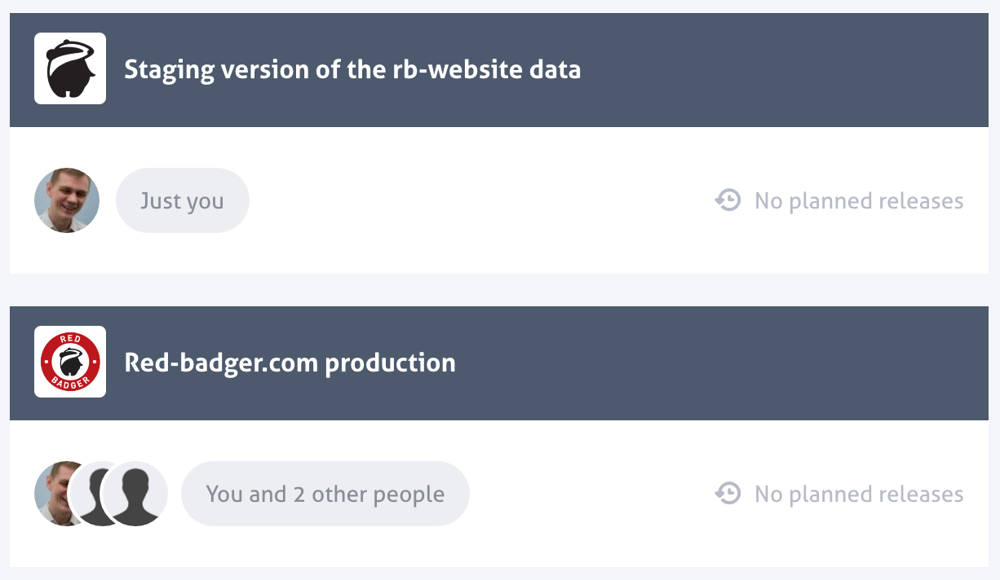
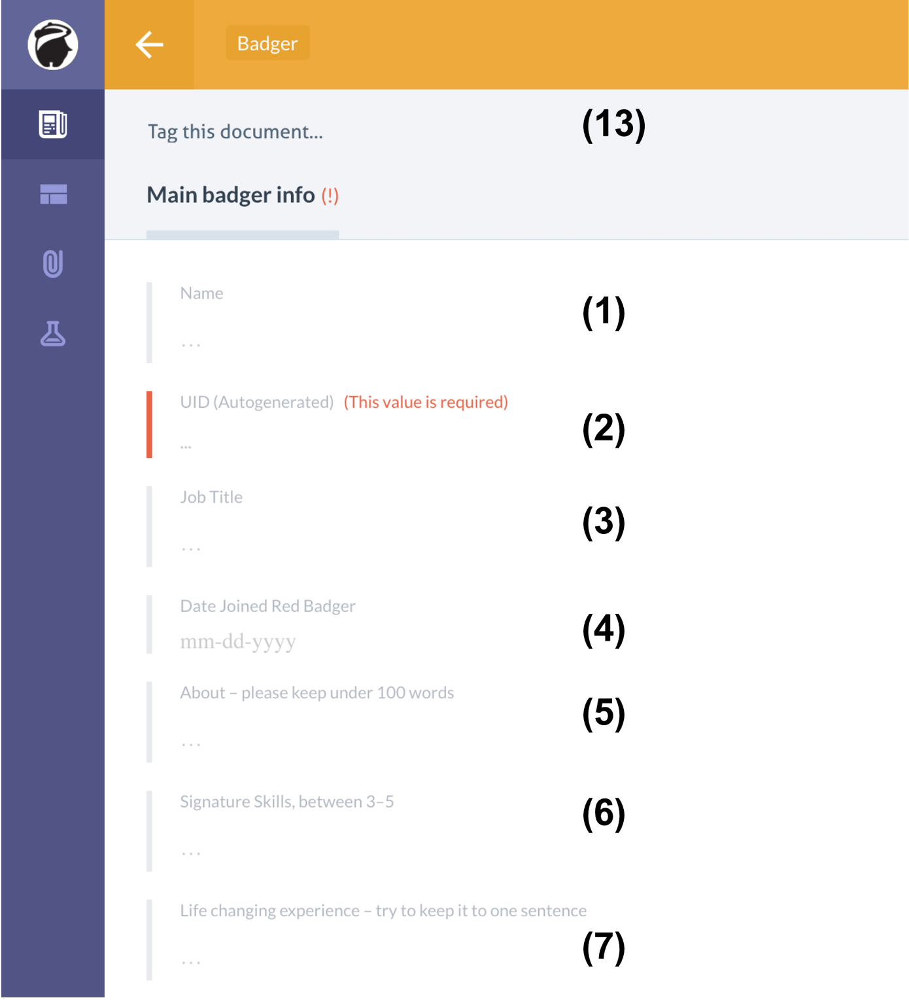
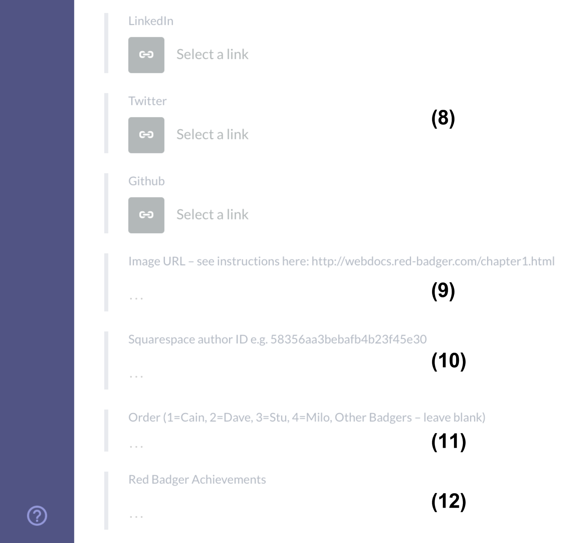

# Updating Badger list

This guide will help you updating the badgers information listed on our website's team page visible
at [https://red-badger.com/about-us/people/](https://red-badger.com/about-us/people/)

Your new item will become available on the live site as soon as you publish it on Prismic.

### Creating

Please use **Red-badger.com production** repository

Press **New -> Badger**

This will present you with a new Badger form.

1. First and Last name of the Badger.
2. The job title of the Badger.
3. The url to the picture to be displayed on the page.
4. The date the Badger started at Red Badger.
5. A summary of the Badger.
6. The signature skills of the Badger.
7. Life changing books/films/experiences of the badger.
8. Achievements at Red Badger.
9. The urls to the Badger's profile on LinkedIn, Twitter and Github.
10. Add tags to the Badger to make them belong to one or more of the following categories:
    - Leadership
    - Strategy
    - PM
    - UX & Design
    - Engineering
    - QA
    - Operations
    - Adorable

These categories are the same that will be used as the buttons to filter Badgers at the
`meet our team`page. If no category is assigned to the Badger, then the Badger will only
appear under the section `Everyone`.

Once the Badger is saved and published on Prismic, it will not immediately become visible on the website.
It should become available the next time an updated version of the website is automatically deployed, approximately once every hour.

### Removing a Badger from the listing

To remove a Badger from the listing, they have to be archived. To do that, find and click on the entry
of the corresponding Badger, then click on the `Archive` button as shown on the image below.

