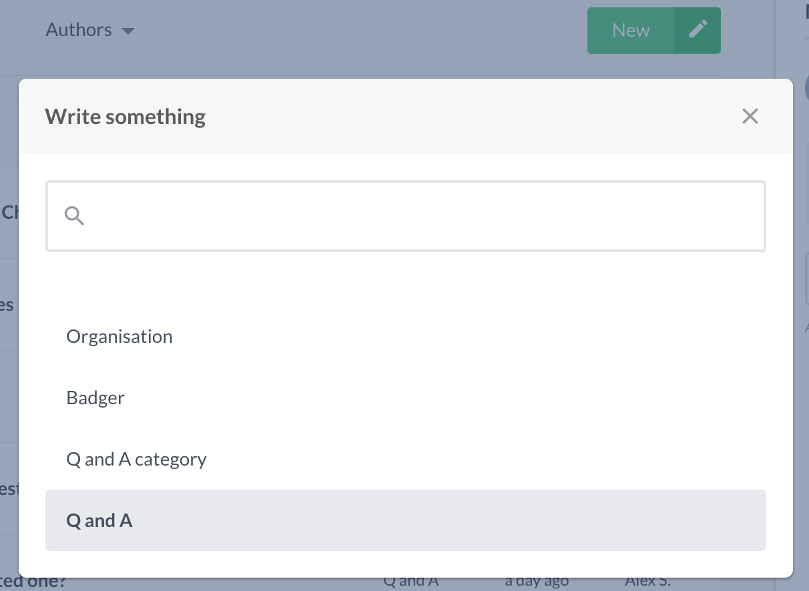

# Updating the Q and A section

This guide will help you update the Q and A section on our website's [about us page](https://red-badger.com/about-us/).

Your new item will become available on the live site as soon as you publish it on Prismic.

### Creating a Q and A

Press **New -> Q and A**

This will present you with a new Q and A form.

1. The question, e.g., 'How much will my project cost?'
2. The answer to the question. You can emphasise parts of your answer by selecting the text and pressing the bold or italics button in the toolbar.

You can hyperlink parts of your answer by selecting the text and pressing the link button in the toolbar. Choose the 'Link to the Web...' option from the dropdown and enter the your web address.

### Creating a Q and A Category
Questions and answers must be attached to categories for them to appear in the UI.

Press **New -> Q and A category**

This will present you with a new Q and A category form.
1. The name of the category.
2. The list of questions and answers. Attach the questions and answers you created above to the category.
