# 🖼️ ✂️️ Using Preview to edit images

## What we’ll do
Make an image 🖼️ the correct size ✂️️ for a website, using:

An Image we want to use online: 
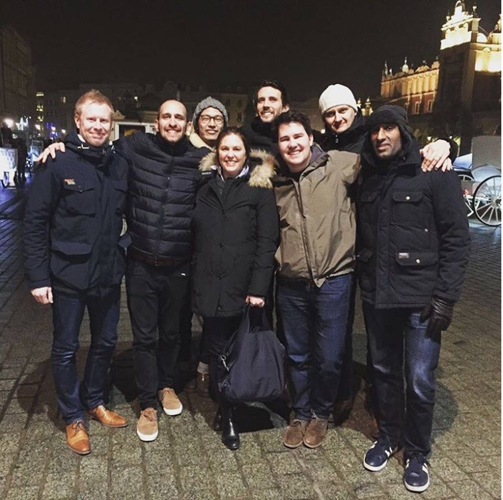

A Template image (the correct size for a certain page or part of a page): 
<kbd>

</kbd>

Some software (Preview): 
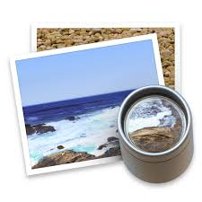

## How to do it
Double click the template to open it in Preview 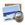.

Double click your chosen image to open it in Preview . 
⌘ A (Select all) 
⌘ C (Copy)

Click into the template 
⌘ V (Paste)

Now your image is inside the template in Preview . The image is probably too big 🎪 for the template so we need to shrink it and position it.

Left-click and pull  the image within the template until you can see the blue dot on the top right corner. 
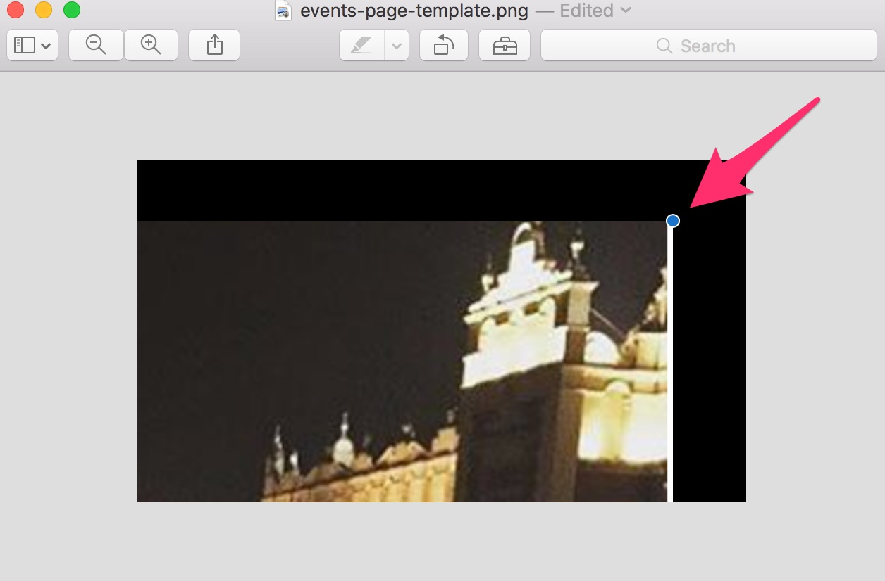

Left-click and drag  the blue dot on the corner to the bottom left. This will shrink your image. 
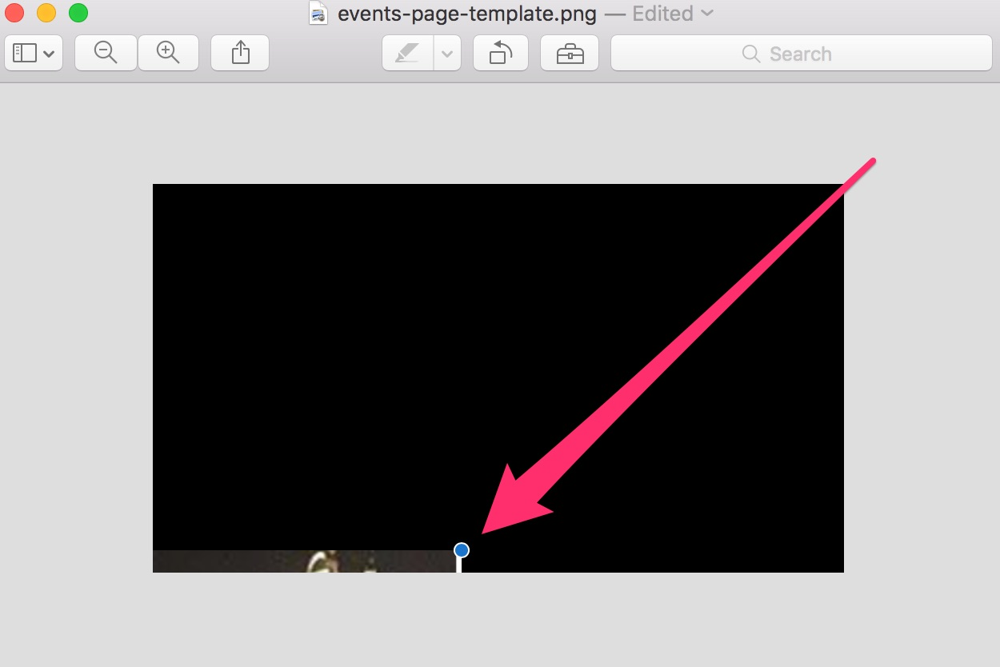

Then left-click on the actual image and pull  it back into the visible part of the template. 
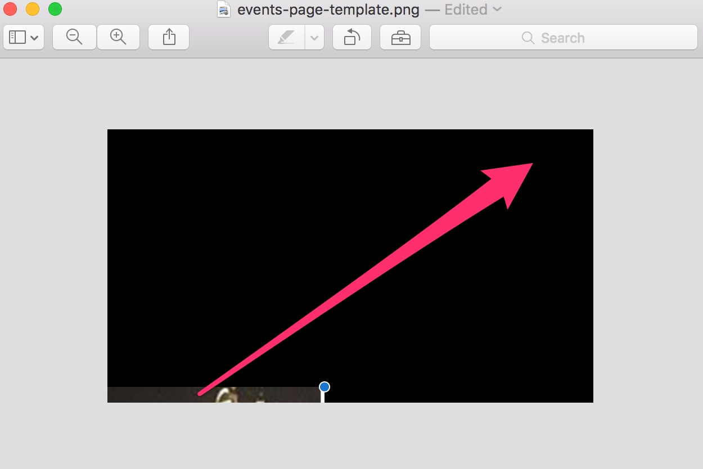  
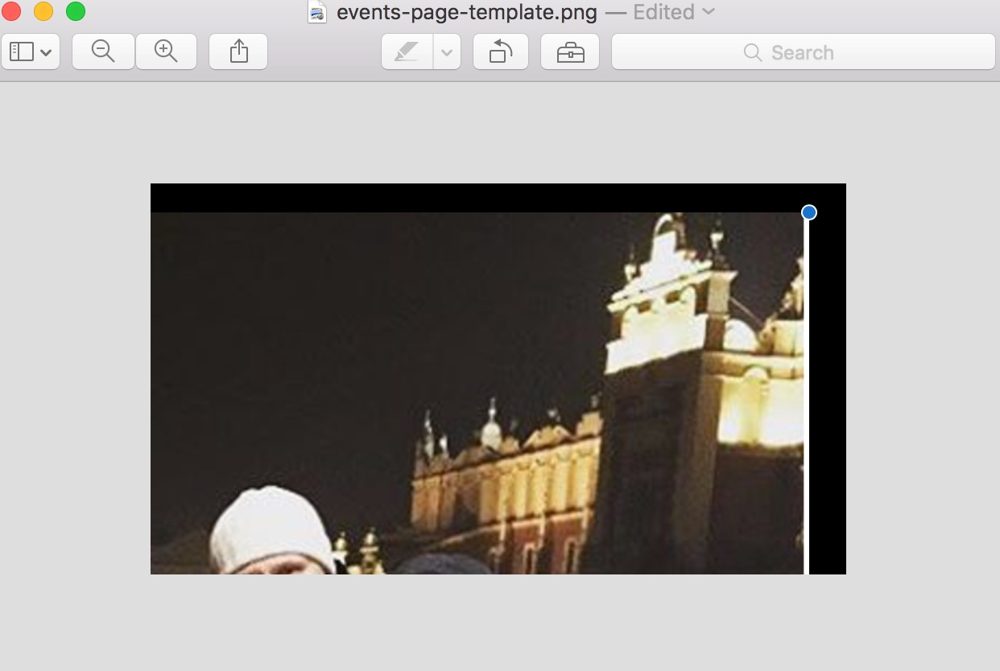

Repeat  : Left-click and drag  the blue dot on the corner to the bottom left. This will shrink your image.
Then left-click on the actual image and pull  it back into the visible part of the template.

Until your image is the desired size.

Now position  your image to your chosen composition. 
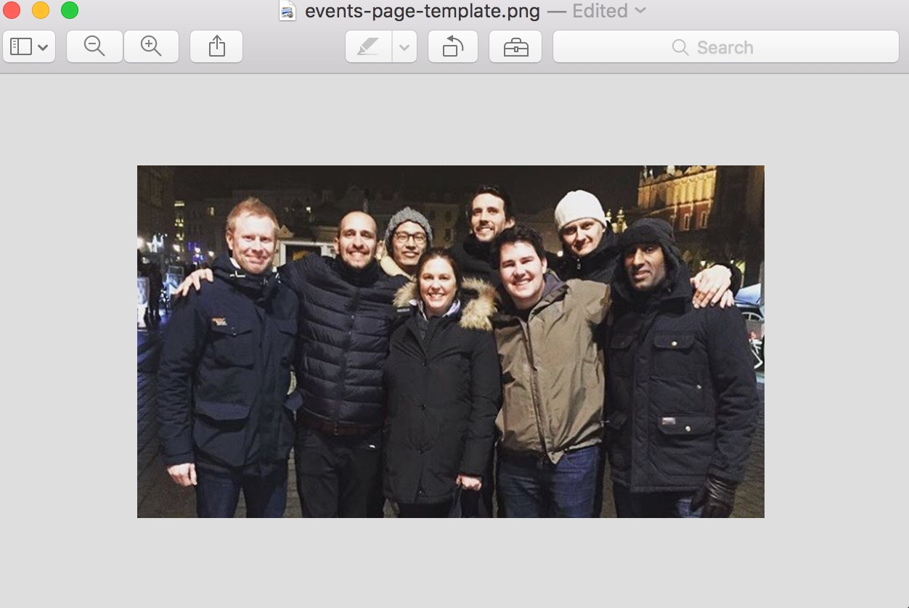

Save 💾 your file: 
File > Export 
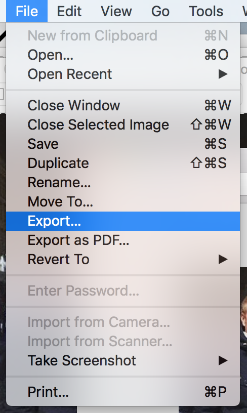

Export As: [Name your file] 
Where: [Choose a destination folder] 
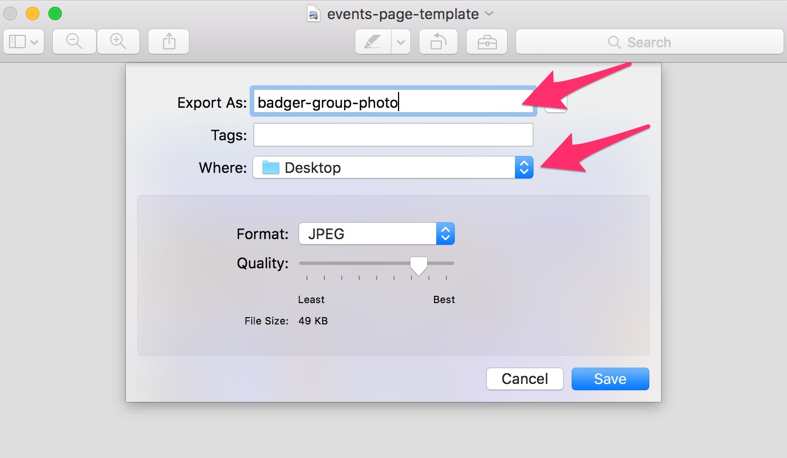

Format:  
[JPEG] for photos 
[PNG] for logos and illustrations

[JPEG] 
Quality: Should ideally be about 75%, no less than 50% 
File Size: Should be as small as possible whilst maintaining a good quality. 
Under 100KB = 👍👍👍 
100KB - 200KB = 👍👍 
200KB - 1MB = 👍 
Over 1MB = 👎🚨

_1000 Bytes (B) = 1 Kilobyte (KB)_ 
_1000KB = 1 Megabyte (MB)_ 
_1000MB = 1 Gigabyte (GB)_ 

[PNG] 
There are no options to adjust for png’s. Use the image sizes above ☝️️ as a guide. 
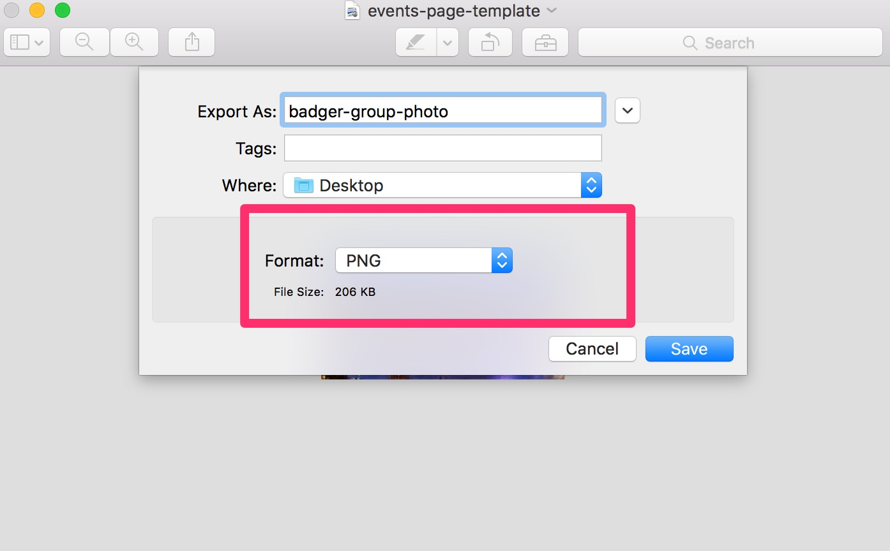

[Save] 
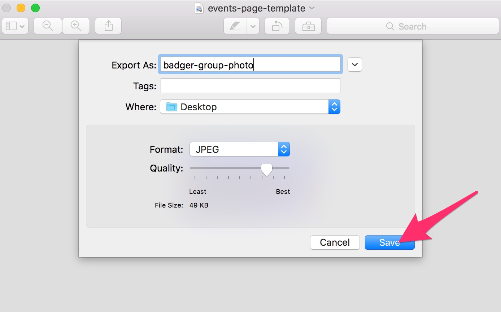

_Voila_ 👏 .

## What to do next ⏩
See the [Cloudinary how-to](/chapter1.md) to learn how to get your image online 📡.

## Templates available
These are sized for retina screens so may seems larger than you expect 😲 . They can be left-clicked and dragged to your desktop directly from this page:

1. Events page images (432px x 243px) 
<kbd>

</kbd>

2. Meetup pages Speaker images (227px x 227px)  
<kbd>

</kbd>
